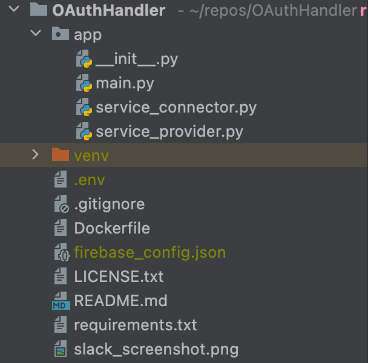

# OAuthHandler

If you are building an application that interacts with other Platform's APIs 
(Eg: Slack, Twitter, Google, Shopify, Notion, etc.) you need an OAuth flow that is:

1. Simple: To handle complex OAuth2 flow to get end users' permission to perform any action on their behalf.
2. Fast and Secure: To store and retrieve Access tokens and Refresh tokens for end-users.
3. Scalable: To be accessed by instances across multiple regions.

Slack says that implementing such OAuth flow is discouragingly hard. Not anymore!

This project implements above OAuth authentication as a microservice.

## How it works

### Signup for the service:
1. Signup for the service by sending a POST request to `/signup` endpoint with email and password sent as form data.
<<Insert a SS of example request>>
2. You would receive a verification mail. Verify your Email to proceed further.
<<Insert a SS of Successful Email Verification>>

### Enable a Service Provider:
3. Enable a Service Provider by sending a POST request to `/enable-provider` endpoint with the following form data:
4. Explain each argument: api/client keys/secret, scopes, provider (twitter), redirect_url, and login creds as.
<<Insert a SS of example request>>

### OAuth-flow for your end-user
5. Now redirect your end-users to hit the authorize-twitter endpoint to start the oauth flow.

### Get updated access token.
6. Finally, Any time you need the working access token for your end-user, you can just hit the get-access-token endpoint.

"EnableServiceProvider" endpoint that first verifies login creds and get user's id.
It also gets as input API_KEY, API_SECRET, CLIENT_ID, CLIENT_SECRET, SCOPES.
It will be documented to use a generic redirect_url "authorization-success" for that service provider.
It will store this information as a field-value pair with key being user's id.
It will return success.

"AuthorizeServiceProvider" endpoint that first verifies login creds and get user's id.
It also gets as input the end_user_id in the above request.
Then this function generates a state and store it as a field in a field-value pair with key being "STATE".
The value for above state field would be concatenation of user_id and end_user_id.

"authorization-success" endpoint. When the user approves the request, Service provider will hit this.
It will get the state and code information from the Service Provider.
It will generate the access and refresh tokens for that particular end-user.
It will save above details in a field:value pair with user_id_end_user_id key.

"get_access_token" for each service provider. It first verifies login creds and get user's id.
It also gets as input end_user_id key.
It will use this info to get access_token and return it to the user.

## Deploying:
  
  ### WIP: Without Docker

  1. checkout code: Git clone on your server/locally
  2. Install a virtual env.
  3. python pip install -r requirements.txt
  4. Install redis on your machine. https://realpython.com/python-redis/
  5. Create a .env file in the project root folder (Inside OAuthHandler).
  6. Copy the firebase_config file in the project root folder (Inside OAuthHandler).
  7. Verify your project structure looks like this: 
  
  8. uvicorn app.main:app --reload --port 8000

  ### WIP: With Docker

  1. checkout code: Git clone on your server/locally
  2. Create a .env file in the project root folder (Inside OAuthHandler).
  3. Copy the firebase_config file in the project root folder (Inside OAuthHandler).
  4. Install redis on your machine. https://realpython.com/python-redis/ with relevant config
  5. Install Docker.
  6. Verify your project structure looks like this: 
  
  7. Run Docker start - add other relevant steps.

## Contribution

This project needs a lot of help from Open Source community.
We need help in writing documentation, testcases, and integrations for upcoming platforms.
This project is a good starting point for people getting started with open source programming.
Please feel free to ask questions and contribute in any way possible.  

## License

Copyright (c) 2022, Rushabh Agarwal
All rights reserved.

This source code is licensed under the BSD-style license found in the
LICENSE file in the root directory of this source tree. 
